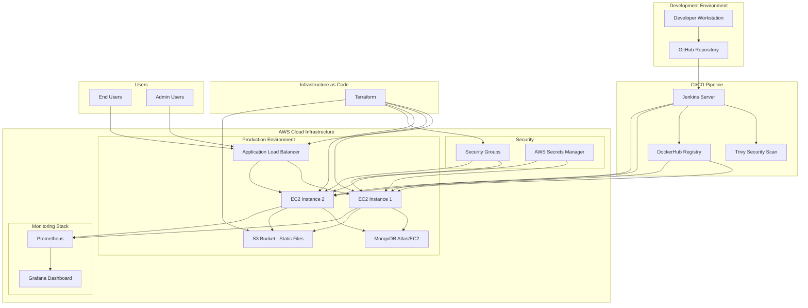

# E-Commerce DevOps Capstone Project

## Overview
A comprehensive Node.js e-commerce application demonstrating modern DevOps practices including CI/CD, containerization, Infrastructure as Code (IaC), and monitoring.

## Architecture



## Features
- User Authentication & Authorization
- Product Catalog Management
- Shopping Cart Functionality
- Order Processing
- Admin Dashboard
- Real-time Monitoring
- Automated CI/CD Pipeline

## Tech Stack
- **Backend**: Node.js, Express.js
- **Database**: MongoDB
- **Containerization**: Docker, Docker Compose
- **CI/CD**: Jenkins
- **Cloud**: AWS (EC2, S3, ALB)
- **IaC**: Terraform
- **Monitoring**: Prometheus, Grafana
- **Security**: Trivy, AWS Secrets Manager

## Project Structure
```
ecommerce-devops-capstone/
├── src/
│   ├── controllers/         # Request handlers
│   ├── models/             # Database models
│   ├── routes/             # API routes
│   ├── middleware/         # Custom middleware
│   ├── config/             # Configuration files
│   └── app.js              # Main application file
├── public/                 # Static assets
├── views/                  # Template files
├── tests/                  # Test files
├── docker/                 # Docker configuration
├── infrastructure/         # Terraform files
├── jenkins/               # Jenkins pipeline configuration
├── monitoring/            # Monitoring configuration
├── docs/                  # Additional documentation
└── README.md
```

## Getting Started

### Prerequisites
- Node.js (v16+)
- Docker & Docker Compose
- AWS CLI configured
- Terraform installed
- Jenkins server access

### Installation
1. Clone the repository
```bash
git clone https://github.com/your-username/ecommerce-devops-capstone.git
cd ecommerce-devops-capstone
```

2. Install dependencies
```bash
npm install
```

3. Set up environment variables
```bash
cp .env.example .env
# Edit .env with your configuration
```

4. Run the application
```bash
npm run dev
```

## Development Workflow

### Git Branching Strategy
- `main`: Production-ready code
- `develop`: Integration branch
- `feature/*`: Feature development
- `release/*`: Release preparation
- `hotfix/*`: Emergency fixes

### Running Tests
```bash
npm test                    # Run all tests
npm run test:watch         # Run tests in watch mode
npm run test:coverage      # Run tests with coverage
```

## Deployment

### Local Development
```bash
docker-compose up -d
```

### Production Deployment
Deployment is automated through Jenkins pipeline. See `jenkins/Jenkinsfile` for details.

## Monitoring
- **Prometheus**: Metrics collection at `http://localhost:9090`
- **Grafana**: Dashboards at `http://localhost:3000`

## Contributing
1. Create a feature branch
2. Make your changes
3. Add tests
4. Submit a pull request

## Documentation
- [API Documentation](docs/api.md)
- [Deployment Guide](docs/deployment.md)
- [Monitoring Setup](docs/monitoring.md)
- [Troubleshooting](docs/troubleshooting.md)

## License
MIT License - see [LICENSE](LICENSE) file for details.

## Project Status
🚧 **In Development** - Capstone Project

---
**Author**: [Aron Kipkorir]  
**University**: [Nairobi DevOps Community]  
**Course**: DevOps Engineering  
**Year**: 2025